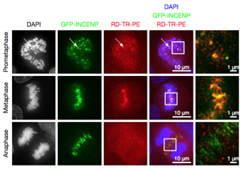

# Image management (import, query and processing) with OMERO
OMERO is a powerful tool for centralizing images in order to view, organize, analyze and share them. It was developed by OME (Open Microscopy Environment) and it works with objects (e.g. Image, Dataset and Project), hence the name OMERO for OME Remote Objects.
This GitHub repository is in addition to a demo video (***Video not uploaded yet***) that shows how to automatically import, query and process images in OMERO. You can find the used codes in the [files repository](Files/) and an example dataset in the [dataset repository](Dataset/).
<!--  -->
## 1- OMERO installation


### OMERO.insight


OMERO.insight is an application to run OMERO. You can check [this good Getting Started document](https://downloads.openmicroscopy.org/help/pdfs/getting-started-5.pdf).

* Download [here](https://www.openmicroscopy.org/omero/downloads/) the appropriate files for your OS.
* Unzip and run the .exe file or `bin/omero-insight`
* Log in to a server. If you just want to try your hand at OMERO, you can use the OME demo server: create your account [here](https://demo.openmicroscopy.org/signup/) and then connect to OMERO.web [here](https://demo.openmicroscopy.org). Otherwise, you can create your own server by installing OMERO.server.


### OMERO.server


Everything you need to install OMERO.server should be **[here](https://omero.readthedocs.io/en/stable/sysadmins/unix/server-installation.html)**. Then, start, stop or restart your server with `omero admin start`, `omero admin stop` and `omero admin restart`.

However, you may encounter some errors. `omero admin diagnostics` helps a lot to identify them.

For example, with this command you can get the version of the Ice module. OMERO needs version 3.6.5 but it is not the latest. To install this specific version, a Python wheel link is provided in the OMERO.server installation guide, but it may generate an error. If this happens, download another file depending on your OS [here](https://github.com/orgs/ome/repositories?q=zeroc-ice&type=all&language=&sort=). Click on one release on the right side of the page and copy the link to the .whl file. For example, on Ubuntu 20.04, [this is the link](https://github.com/ome/zeroc-ice-ubuntu2004/releases/download/0.2.0/zeroc_ice-3.6.5-cp38-cp38-linux_x86_64.whl).

Moreover, activating/deactivating the Python virtual environment may restart some environment variables such as `icegridadmin` (you can find "icegridadmin not found" with `omero admin diagnostics`). In this case, just rerun:
```
export ICE_HOME=/opt/ice-3.6.5
export PATH="$ICE_HOME/bin:$PATH"
export SLICEPATH="$ICE_HOME/slice"
```

Sometimes, the `omero admin diagnostics` command just doesn't work. This may be due to a wrong `OMERODIR` environment variable, so run:
```
export OMERODIR=/opt/omero/server/OMERO.server
```

Finally, to avoid a DH key too small error, log in to OMERO.insight as root to the `localhost` server. The guide suggests `root` as username and `omero_root_password` as password.


### OMERO.web


With OMERO.web, you can create your own webclient ***to connect to your server anywhere***.

Everything you need to install OMERO.web should be **[here](https://omero.readthedocs.io/en/stable/sysadmins/unix/install-web/web-deployment.html)**. Then, start, stop or restart your webclient with `omero web start`, `omero web stop` and `omero web restart`.

Again, pay attention to the Ice version (see above).

In the step `omero web config nginx --http "${WEBPORT}" –servername "${WEBSERVER_NAME}" > /opt/omero/web/omero-web/nginx.conf.tmp`, be careful to the line break when copying and, if necessary, create the file first in a folder where you have all permissions before moving it to the right repository.

Finally, if you get this error:
```
FATAL: Running /usr/local/bin/omero as root can corrupt your directory permissions
```
Try changing the permssions of all subdirectories:
```
sudo chmod 777 /opt/omero/web/omero-web
sudo chmod 777 /opt/omero/web/omero-web/*
sudo chmod 777 /opt/omero/web/omero-web/*/*
Etc.
```
***But I still don't know how to add clients...***


## 2- Practice with this repository
Feel free to download [all the Python codes](Files/) and [the example dataset](Dataset/) and try to reproduce what is shown in the demo video ***(link)***. Note that in each file, you will find a Link section at the end to have further information about the code used.

Here are some details about the python files:
1. [**Create a project and datasets**](Files/1_Create_project_and_datasets.py): To start, create a place to save your data. In OMERO, images are always stored in datasets, and datasets can be stored in projects.
2. [**Import images**](Files/2_Image_import.py): Next, import your images using the CLI (Command Line Interface). There are several ways to import images, the classical way will copy-paste everything (which is not interesting for large datasets). Here, we use the so called "In-place" import to just create a link to the original file.
3. [**Metadata import**](Files/3_Metadata_import.py): Each image has some relative information that can be stored in a .csv file. Here we associate all these metadata with each image as Key:Value pairs (e.g. Year:2020).
4. [**Queries**](Files/4_Queries.py): We can use the metadata to search for specific images and save the result.
5. [**OMERO.script**](Files/Threshold_script.py): It is possible to combine all the codes to create a script that can be imported into OMERO.insight to perform any image processing you want (here, an RGB threshold was chosen) on a specific set of images from a query.

## 3- Annexes
If you want to go deeper into OMERO. Here is some additional information to try to cover the whole OMERO world.

### Skipped features

#### OMERO.iviewer


With OMERO.iviewer, you can create and edit ROIs and perform some simple image processing. Here is [an overview](https://www.openmicroscopy.org/omero/iviewer) and the [full documentation](https://omero-guides.readthedocs.io/en/latest/iviewer/docs/index.html).


#### OMERO.figure


It is possible to create your own figures for publication using the server, i.e. without downloading any image. Here is [an overview](https://www.openmicroscopy.org/omero/figure/) and the [full documentation](https://omero-guides.readthedocs.io/en/latest/figure/docs/index.html).



#### Other intresting features
* As well as OMERO.iviewer and OMERO.figure, there are [other OMERO.web add-ons](https://omero-guides.readthedocs.io/en/latest/web_addons.html).
* [OMERO.tables](https://omero.readthedocs.io/en/stable/developers/Tables.html) for data storage and analysis
* OMERO.web [custom applications](https://omero.readthedocs.io/en/stable/developers/Web/CreateApp.html) and [webclient plugins](https://omero.readthedocs.io/en/stable/developers/Web/WebclientPlugin.html)
* [Other annotation types](https://omero.readthedocs.io/en/stable/developers/Model/StructuredAnnotations.html#annotation-hierarchy) (e.g. comments and tags)
* [OMERO.dropbox](https://omero.readthedocs.io/en/stable/sysadmins/dropbox.html) for automatic import and [other import methods](https://omero.readthedocs.io/en/stable/sysadmins/import-scenarios.html)
* [OMERO.mde](https://omero-guides.readthedocs.io/en/latest/mde/docs/index.html) (an extension of OMERO.importer) to retrieve original metadata.

### Useful links
* The [complete current OMERO documentation](https://omero.readthedocs.io/) and [all the documentation versions](https://docs.openmicroscopy.org/)
* The [forum](https://forum.image.sc/tag/omero) (and [its previous version](https://www.openmicroscopy.org/community/viewforum.php?f=3))
* The [Python language bindings](https://omero.readthedocs.io/en/stable/developers/Python.html) and the [OMERO.py documentation](https://omero-py.readthedocs.io/en/stable/)
* The [OME GitHub](https://github.com/ome) and the [OMERO GitHub topic](https://github.com/topics/omero).
* All the [OMERO model objects](https://omero.readthedocs.io/en/stable/developers/Model/EveryObject.html) and the [OME website with OMERO links](http://www.openmicroscopy.org/index.html).
