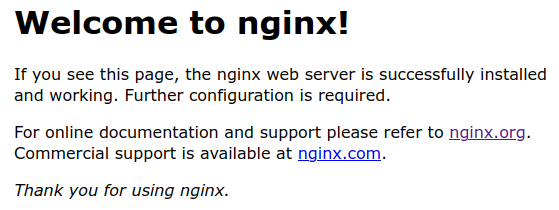
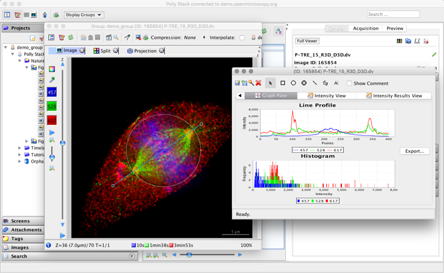
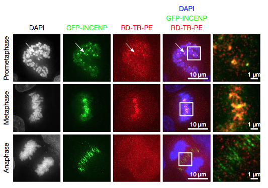

# Image management (import, query and processing) with OMERO
OMERO is a powerful tool for centralizing images in order to view, organize, analyze and share them.

It was developed by OME (Open Microscopy Environment) and it works with objects (e.g. Image, Dataset and Project), hence the name OMERO for OME Remote Objects.

This GitHub repository is in addition to [a demo video](https://youtu.be/w03FbtofhTY) (click on the thumbnail below) that shows how to automatically import, query and process images in OMERO. You can find the used codes in the [files repository](Files/) and an example dataset in the [dataset repository](Dataset/).

<p align="center">
  <a href="https://youtu.be/w03FbtofhTY"></img></a>
</p>

<!--  -->

## Table of contents
- [1- OMERO installation](#1--omero-installation)
  - [a. OMERO.insight](#a-omeroinsight)
  - [b. OMERO.server](#b-omeroserver)
  - [c. OMERO.web](#c-omeroweb)
      - [Installation](#installation)
      - [Access to OMERO.server from your network](#access-to-omeroserver-from-your-network)
      - [Access to OMERO.server from anywhere](#access-to-omeroserver-from-anywhere)
      - [OMERO.webclient VS OMERO.insight](#omerowebclient-vs-omeroinsight)
- [2- Practice with this repository](#2--practice-with-this-repository)
- [3- Annexes](3--annexes)
  - [a. Skipped features](#a-skipped-features)
    - [OMERO.iviewer](#omeroiviewer)
    - [OMERO.figure](#omerofigure)
    - [Other intresting features](#other-intresting-features)
  - [b. Useful links](#b-useful-links)


## 1- OMERO installation
The commands presented here have been realized with Ubuntu 20.04.

### a. OMERO.insight


OMERO.insight is an application to run OMERO. You can check [this good Getting Started document](https://downloads.openmicroscopy.org/help/pdfs/getting-started-5.pdf).

* Download [here](https://www.openmicroscopy.org/omero/downloads/) the appropriate files for your OS.
* Unzip and run the .exe file or `bin/omero-insight`
* Log in to a server. If you just want to try your hand at OMERO, you can use the OME demo server: create your account [here](https://demo.openmicroscopy.org/signup/) and then connect to OMERO.web [here](https://demo.openmicroscopy.org). Otherwise, you can create your own server by installing OMERO.server.


### b. OMERO.server


Everything you need to install OMERO.server should be **[here](https://omero.readthedocs.io/en/stable/sysadmins/unix/server-installation.html)**. Then, start, stop or restart your server with `omero admin start`, `omero admin stop` and `omero admin restart` from the virtual environment created.

However, you may encounter some errors. `omero admin diagnostics` helps a lot to identify them.

For example, with this command you can get the version of the Ice module. OMERO needs version 3.6.5 but it is not the latest. To install this specific version, a Python wheel link is provided in the OMERO.server installation guide, but it may generate an error. If this happens, download another file depending on your OS [here](https://github.com/orgs/ome/repositories?q=zeroc-ice&type=all&language=&sort=). Click on one release on the right side of the page and copy the link to the .whl file. For example, on Ubuntu 20.04, [this is the link](https://github.com/ome/zeroc-ice-ubuntu2004/releases/download/0.2.0/zeroc_ice-3.6.5-cp38-cp38-linux_x86_64.whl).

Moreover, activating/deactivating the Python virtual environment may restart some environment variables such as `icegridadmin` (you can find "icegridadmin not found" with `omero admin diagnostics`). In this case, just rerun:
```
export ICE_HOME=/opt/ice-3.6.5
export PATH="$ICE_HOME/bin:$PATH"
export SLICEPATH="$ICE_HOME/slice"
```

Sometimes, the `omero admin diagnostics` command just doesn't work. This may be due to a wrong `OMERODIR` environment variable, so run:
```
export OMERODIR=/opt/omero/server/OMERO.server
```

Finally, to avoid a DH key too small error, log in to OMERO.insight as root to the `localhost` server. The guide suggests `root` as username and `omero_root_password` as password.


### c. OMERO.web


With OMERO.web, you can create your own webclient to connect to your server anywhere.

#### Installation
Everything you need to install OMERO.web should be **[here](https://omero.readthedocs.io/en/stable/sysadmins/unix/install-web/web-deployment.html)**. Then, start, stop or restart your webclient with `omero web start`, `omero web stop` and `omero web restart` from the virtual environment created.

Again, pay attention to the Ice version (see above).

In the step `omero web config nginx --http "${WEBPORT}" –servername "${WEBSERVER_NAME}" > /opt/omero/web/omero-web/nginx.conf.tmp`, `${WEBPOT}` corresponds to `80` for HTTP or `443` for HTTPS (`443`is recommanded) and `${WEBSERVER_NAME}`corresponds to `localhost`.

Several errors may occur. For example, if you get:
```
FATAL: Running /usr/local/bin/omero as root can corrupt your directory permissions
```
Try changing the permssions of all subdirectories:
```
sudo chmod 777 /opt/omero/web/omero-web
sudo chmod 777 /opt/omero/web/omero-web/*
sudo chmod 777 /opt/omero/web/omero-web/*/*
sudo chmod 777 /opt/omero/web/omero-web/*/*/*
...
```

You may also have a problem when stopping the server, when you get a warning that you should kill some processes by hand. If you ignore this, the server will remain in "development state" (how you can see it with `omero web status`). This state will often returns this error:
```
ERROR: configuration mismatch. omero.web.application_server=development cannot be used with YOUR_COMMAND
```
Try reexporting environment variables to fix this:
```
export WEBSESSION=True
export OMERODIR=/opt/omero/web/omero-web
export PATH=/opt/omero/web/venv3/bin:$PATH
```

#### Access to OMERO.server from your network
From your machine where the server is mounted, you should be able to log in to the webclient as root by browsing to [localhost](http://localhost) (or [127.0.0.1](http://127.0.0.1), which means the same thing). If you [set up a prefix](https://omero.readthedocs.io/en/stable/sysadmins/unix/install-web/walkthrough/omeroweb-install-ubuntu2004-ice3.6.html#configuring-omero-web), as proposed in the guide, like `/omero`, you may see the page below (which is not actually an error). Just go to [localhost/omero](http://localhost/omero) (or [127.0.0.1/omero](http://127.0.0.1/omero)) to find the webclient.

<p align="center">
  
</p>

To share your local server with other machines on the same network, you need to find your local IP address. You can look in the parameters or run `hostname -I` on Linux or `ipconfig` on Windows and Mac. It should look like `192.168.X.X`.

Then you should be able to connect by following a link like [http://192.168.0.175](https://youtu.be/dQw4w9WgXcQ) or [http://192.168.0.175/omero](https://youtu.be/dQw4w9WgXcQ).

If this doesn't work, you can try adding your port in the address using this template: `http://<YOU_LOCAL_IP_ADDRESS>:<YOUR_PORT>`.

#### Access to OMERO.server from anywhere
To be able to use your server no matter on what you are connected to, it is necessary to do some [port forwarding](https://en.wikipedia.org/wiki/Port_forwarding) (also called tunneling). To avoid some complicated settings and security risks, it is possible to use some tunneling tools. A great comparison of available solutions is proposed [here](https://github.com/anderspitman/awesome-tunneling). In this ReadMe, we will show how to create a public URL from our local server using [LocalToNet](https://localtonet.com).

* Sign up [here](https://localtonet.com/Identity/Account/Register)
* In the [My Tokens section](https://localtonet.com/usertoken), copy your token
* On Linux, run the following commands (steps for other OS are [here](https://localtonet.com/blog/how-to-use-localtonet))
  ```
  wget https://localtonet.com/download/localtonet-linux-x64.zip
  unzip localtonet-linux-x64.zip
  chmod 777 ./localtonet
  ./localtonet authtoken TOKEN_YOU_COPIED
  ```
* Create a tunnel [here](https://localtonet.com/tunnel/http) with a random subdomain (otherwise you have to pay), the default token, the default server, the default IP address and the port you set up (`80` or `443`).
* Then, click on the Start button and your tunnel should appear on the terminal where you launched LocalToNet.
* Finally, you can send your URL to anyone you want to access from anywhere (you can even customize the link with a URL shortener such as [Bitly](https://bitly.com/a/sign_up)).

<br />

If you are determinate to use the public IP address. You can find it for example on [this page](https://ipinfo.io/ip). You can try to connect from your original network (by adding your port), but without a router loopback you will get this error because you are trying to connect to your own router:
```
Rejected request from RFC1918 IP to public server address
```
If you try to connect from another router without changing your router parameter, you should get some `ERR_CONNECTION_RESET`-like or `ERR_CONNECTION_TIMED_OUT`-like errors since you haven't port forwarded. There are plenty of guides on the net to change your router settings such as [this one](https://www.noip.com/support/knowledgebase/general-port-forwarding-guide), but keep in mind that it will give more unsafe access to your computer.

#### OMERO.webclient VS OMERO.insight
Congratulations! Now everyone can access to your server.

The webclient allows users to have a quick overview of the server, but it has neither a native image importer nor a search menu (which are bypassable with [OMERO.script](https://omero-guides.readthedocs.io/projects/python/en/latest/server_script.html), see next section).

On the other hand, a user can install [OMERO.insight](#a-omeroinsight) and connect to your server ***using your public IP address***.

## 2- Practice with this repository
Feel free to download [all the Python codes](Files/) and [the example dataset](Dataset/) and try to reproduce what is shown in the demo video ***(link)***. Note that in each file, you will find a Link section at the end to have further information about the code used.

Here are some details about the python files:
1. [**Create a project and datasets**](Files/1_Create_project_and_datasets.py): To start, create a place to save your data. In OMERO, images are always stored in datasets, and datasets can be stored in projects.
2. [**Import images**](Files/2_Image_import.py): Next, import your images using the CLI (Command Line Interface). There are several ways to import images, the classical way will copy-paste everything (which is not interesting for large datasets). Here, we use the so called "In-place" import to just create a link to the original file.
3. [**Metadata import**](Files/3_Metadata_import.py): Each image has some relative information that can be stored in a .csv file. Here we associate all these metadata with each image as Key:Value pairs (e.g. Year:2020).
4. [**Queries**](Files/4_Queries.py): We can use the metadata to search for specific images and save the result.
5. [**OMERO.script**](Files/Threshold_script.py): It is possible to combine all the codes to create a script that can be imported into OMERO.insight to perform any image processing you want (here, an RGB threshold was chosen) on a specific set of images from a query.

## 3- Annexes
If you want to go deeper into OMERO. Here is some additional information to try to cover the whole OMERO world.

### a. Skipped features

#### OMERO.iviewer


With OMERO.iviewer, you can create and edit ROIs and perform some simple image processing. Here is [an overview](https://www.openmicroscopy.org/omero/iviewer) and the [full documentation](https://omero-guides.readthedocs.io/en/latest/iviewer/docs/index.html).

<p align="center">
  
</p>

#### OMERO.figure


It is possible to create your own figures for publication using the server, i.e. without downloading any image. Here is [an overview](https://www.openmicroscopy.org/omero/figure/) and the [full documentation](https://omero-guides.readthedocs.io/en/latest/figure/docs/index.html).

<p align="center">
  
</p>

#### Other intresting features
* As well as OMERO.iviewer and OMERO.figure, there are [other OMERO.web add-ons](https://omero-guides.readthedocs.io/en/latest/web_addons.html).
* [OMERO.tables](https://omero.readthedocs.io/en/stable/developers/Tables.html) for data storage and analysis
* OMERO.web [custom applications](https://omero.readthedocs.io/en/stable/developers/Web/CreateApp.html) and [webclient plugins](https://omero.readthedocs.io/en/stable/developers/Web/WebclientPlugin.html)
* [Other annotation types](https://omero.readthedocs.io/en/stable/developers/Model/StructuredAnnotations.html#annotation-hierarchy) (e.g. comments and tags)
* [OMERO.dropbox](https://omero.readthedocs.io/en/stable/sysadmins/dropbox.html) for automatic import and [other import methods](https://omero.readthedocs.io/en/stable/sysadmins/import-scenarios.html)
* [OMERO.mde](https://omero-guides.readthedocs.io/en/latest/mde/docs/index.html) (an extension of OMERO.importer) to retrieve original metadata.

### b. Useful links
* The [complete current OMERO documentation](https://omero.readthedocs.io/) and [all the documentation versions](https://docs.openmicroscopy.org/)
* The [forum](https://forum.image.sc/tag/omero) (and [its previous version](https://www.openmicroscopy.org/community/viewforum.php?f=3))
* The [Python language bindings](https://omero.readthedocs.io/en/stable/developers/Python.html) and the [OMERO.py documentation](https://omero-py.readthedocs.io/en/stable/)
* The [OME GitHub](https://github.com/ome) and the [OMERO GitHub topic](https://github.com/topics/omero).
* All the [OMERO model objects](https://omero.readthedocs.io/en/stable/developers/Model/EveryObject.html) and the [OME website with OMERO links](http://www.openmicroscopy.org/index.html).
